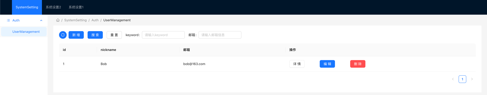

# Cluo CMS Java Project

Cluo CMS is a Java framework built on top of Spring Boot that provides a set of annotations, such as `@CmsMapping`, `@CmcController`, and `@CmsField`, to develop APIs. The framework automatically scans for these annotations, and based on the annotation information, generates a management backend with features like CRUD operations, reporting, statistics, and various toggles. The backend is powered by a Java backend and a React frontend, where the frontend files are stored within the backend.

Cluo CMS是一个基于Spring Boot的Java框架，提供了一系列注解，如`@CmsMapping`、`@CmcController`和`@CmsField`，用于开发API接口。该框架会自动扫描这些注解，并基于注解信息生成一个管理后台，具备增删改查、报表、统计和各种开关等功能。后台由Java后端和React前端组成，前端文件存储在后端中。

## Features

- Simplified API development using `@CmsMapping`, `@CmcController`, and `@CmsField` annotations.
- Automatic generation of a management backend based on the annotated APIs.
- CRUD operations for managing data.
- Reporting and statistics functionalities.
- Toggle switches for various features.

## 技术栈 (Tech Stack)

- Java 17
- Spring Boot 2.7.11
- React 18.2.0
- Ant Design (antd) 5.5.2

## 快速启动 (Quick Start)

要快速启动Cluo CMS框架，请按照以下步骤进行操作：

1. 在你的项目中的`pom.xml`文件中添加以下依赖：

   ```xml
   <dependency>
     <groupId>org.cluo.framework</groupId>
     <artifactId>cluo-cms</artifactId>
     <version>1.0.0-antd</version>
   </dependency>
   ```

2. 创建一个Spring Boot应用程序，并确保在主类上添加`@EnableCms`注解：

   ```java
   import org.springframework.boot.SpringApplication;
   import org.springframework.boot.autoconfigure.SpringBootApplication;
   import org.cluo.framework.cms.annotation.EnableCms;
   
   @SpringBootApplication
   @EnableCms
   public class YourApplication {
   
     public static void main(String[] args) {
       SpringApplication.run(YourApplication.class, args);
     }
   }
   ```

3. 创建使用`@CmcController`和`@CmsMapping`注解的控制器类。例如：
   
   ```java
    package org.cluo.framework.management.demo.controller;
   
    import org.cluo.framework.management.annotation.CmsController;
    import org.cluo.framework.management.annotation.CmsField;
    import org.cluo.framework.management.annotation.CmsMapping;
    import org.cluo.framework.management.annotation.CmsRequestBody;
    import org.cluo.framework.management.model.api.CluoList;
    import org.cluo.framework.management.model.common.enums.CmsAction;
    import org.springframework.web.bind.annotation.RequestMapping;
    import org.springframework.web.bind.annotation.RequestParam;
    
    import java.util.HashMap;
    import java.util.Map;
    import java.util.stream.Collectors;
    
    /**
    * @author canfuu.cts
    * @class DemoController
    * @date 2023/6/3 13:05
      */
    @CmsController(top = "SystemSetting", left = "Auth", leftSub = "UserManagement")
    @RequestMapping("/demo211")
    public class Demo211Controller {
   
    private Map<String, UserResponse> users = new HashMap<>();
   
    /**
    * for search users' list
    * @param userRequest param
    * @return data list
    */
    @CmsMapping(path = "/user", action = CmsAction.ListSelectData)
    public CluoList<UserResponse> userList(@CmsRequestBody UserRequest userRequest) {
        return CluoList.of(users.size(), users.values().stream().filter(userResponse -> {
            return userRequest.getKeyword() == null || userRequest.getKeyword().isEmpty() || userResponse.nickname.contains(userRequest.getKeyword());
        }).filter(userResponse -> {
            return userRequest.getEmail() == null || userRequest.getEmail().isEmpty() || userResponse.email.contains(userRequest.getEmail());
        }).collect(Collectors.toList()));
    }
   
   
    /**
     * for insert user
       * @param userResponse param
       */
    @CmsMapping(path = "/user/insert", action = CmsAction.ListInsertData)
    public void userInsert(@CmsRequestBody UserResponse userResponse) {
        users.put(userResponse.getId(), userResponse);
    }
   
    /**
     * for update user
     * @param userResponse param
     */
    @CmsMapping(path = "/user/update", action = CmsAction.ListUpdateData)
    public void userUpdate(@CmsRequestBody UserResponse userResponse) {
        users.put(userResponse.getId(), userResponse);
    }
   
    /**
    * for delete user
    * @param id param
    */
    @CmsMapping(path = "/user/delete", action = CmsAction.ListDeleteData, keyField = "id")
    public void userDelete(@RequestParam("id") String id) {
        users.remove(id);
    }
   
    /**
     * for search detail user
     * @param id param
     * @return data
     */
    @CmsMapping(path = "/user/detail", action = CmsAction.ListSelectDetail, keyField = "id")
    public UserResponse userDetail(@RequestParam("id") String id) {
        return users.get(id);
    }
    
    public static class UserRequest {
        private String keyword;
        @CmsField(displayName = "邮箱", regex = "[a-zA-Z0-9_-]+@[a-zA-Z0-9_-]+(\\.[a-zA-Z0-9_-]+)+", placeholder = "请输入邮箱信息", tips = "请输入正确的邮箱信息")
        private String email;
   
        public String getKeyword() {
            return keyword;
        }
   
        public UserRequest setKeyword(String keyword) {
            this.keyword = keyword;
            return this;
        }
   
        public String getEmail() {
            return email;
        }
   
        public UserRequest setEmail(String email) {
            this.email = email;
            return this;
        }
    }
   
    public static class UserResponse {
   
        private String id;
   
        private String nickname;
   
        @CmsField(displayName = "邮箱",regex = "[a-zA-Z0-9_-]+@[a-zA-Z0-9_-]+(\\.[a-zA-Z0-9_-]+)+", placeholder = "请输入邮箱信息", tips = "请输入正确的邮箱信息")
        private String email;
        
   
        public String getId() {
            return id;
        }
   
        public UserResponse setId(String id) {
            this.id = id;
            return this;
        }
   
        public String getNickname() {
            return nickname;
        }
   
        public UserResponse setNickname(String nickname) {
            this.nickname = nickname;
            return this;
        }
   
        public String getEmail() {
            return email;
        }
   
        public UserResponse setEmail(String email) {
            this.email = email;
            return this;
        }
    }
   }

   ```

4. 运行你的应用程序，并访问Cluo CMS的管理后台：

   ```
   http://localhost:3000
   ```

   请确保Cluo CMS前端文件已经被正确地嵌入到后端项目中。

5. 在管理后台中，你应该能够看到你创建的控制器类和API。你可以根据需要进行数据管理、报表和统计等操作。

这样，你就可以通过Cluo CMS框架快速开发管理后台功能了！

# 参与开发/源码部署 

## 安装 (Installation)

1. 克隆项目到本地计算机：

   ```shell
   git clone https://github.com/your-username/cluo-cms.git
   ```

2. 进入项目目录：

   ```shell
   cd cluo-cms
   ```

3. 构建项目：

   ```shell
   mvn clean install
   ```

## 使用说明 (Usage)

1. 启动后端服务：

   ```shell
   mvn spring-boot:run
   ```

2. 启动前端应用：

   ```shell
   cd frontend
   npm install
   npm start
   ```

3. 在浏览器中访问管理后台：

   ```
   http://localhost:3000
   ```

   这里假设后端服务运行在默认的端口号 8080。

4. 根据框架生成的管理后台，进行数据管理、报表和统计等操作。

## 贡献 (Contribution)

欢迎对该项目进行贡献！如果你发现了任何问题或者有任何建议，请提交 issue 或者 PR。

## 许可证 (License)

该项目基于 MIT 许可证。详细信息请参阅 [LICENSE](LICENSE) 文件。

## 需求和问题 (Requirements & Issues)

如果你在使用该项目时遇到任何问题或有任何需求，请在 GitHub 上提交 issue。我们

会尽力解决你的问题并改进该项目。

---

# Cluo CMS Java Project

Cluo CMS is a Java framework built on top of Spring Boot that provides a set of annotations, such as `@CmsMapping`, `@CmcController`, and `@CmsField`, to develop APIs. The framework automatically scans for these annotations, and based on the annotation information, generates a management backend with features like CRUD operations, reporting, statistics, and various toggles. The backend is powered by a Java backend and a React frontend, where the frontend files are stored within the backend.

## Features

- Simplified API development using `@CmsMapping`, `@CmcController`, and `@CmsField` annotations.
- Automatic generation of a management backend based on the annotated APIs.
- CRUD operations for managing data.
- Reporting and statistics functionalities.
- Toggle switches for various features.

## Tech Stack

- Java 17
- Spring Boot 2.7.11
- React 18.2.0
- Ant Design (antd) 5.5.2

## Installation

1. Clone the project to your local machine:

   ```shell
   git clone https://github.com/your-username/cluo-cms.git
   ```

2. Navigate to the project directory:

   ```shell
   cd cluo-cms
   ```

3. Build the project:

   ```shell
   mvn clean install
   ```

## Usage

1. Start the backend service:

   ```shell
   mvn spring-boot:run
   ```

2. Start the frontend application:

   ```shell
   cd frontend
   npm install
   npm start
   ```

3. Access the management backend in your browser:

   ```
   http://localhost:3000
   ```

   This assumes the backend service is running on the default port 8080.

4. Use the generated management backend to perform data management, reporting, and statistics operations.

## Contribution

Contributions to this project are welcome! If you find any issues or have any suggestions, please submit an issue or a pull request.

## License

This project is licensed under the MIT License. See the [LICENSE](LICENSE) file for more information.

## Requirements & Issues

If you encounter any issues or have any requirements while using this project, please submit an issue on GitHub. We will do our best to address your concerns and improve the project.